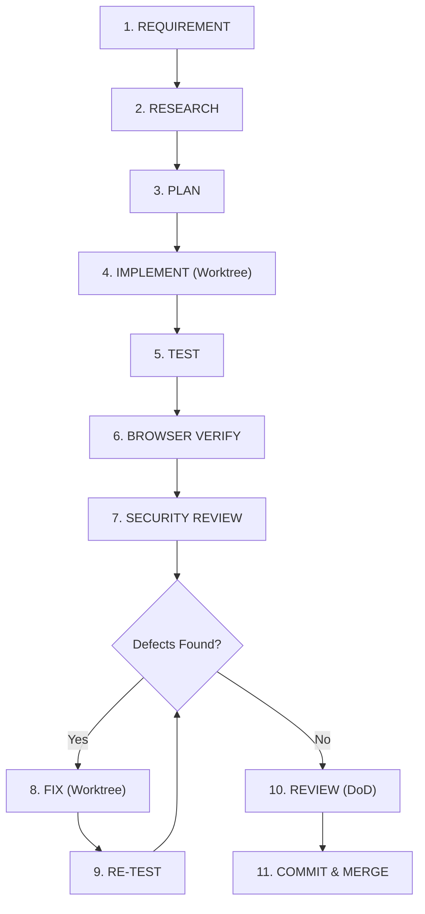

---
name: iteration
description: Orchestrates the complete end-to-end software development lifecycle loop from requirements through research, planning, implementation, automated testing, browser verification, security review, bug-fixing, re-testing, code review, and final commit. Enforces iterative remediation when failures occur. Use to guide full feature delivery cycles.
---

# Iteration Skill

## Overview
This skill operationalizes the core CalmStacks engineering cycle:
```
REQUIREMENT -> RESEARCH -> PLAN -> IMPLEMENT -> TEST -> BROWSER VERIFY -> SECURITY REVIEW -> FIX -> RE-TEST -> REVIEW -> COMMIT
```
No feature is considered complete merely because it compiles or runs without immediate errors. Any verified failure must be remediated and the affected verification gates repeated.

---

## The 11-Stage Iteration Lifecycle



---

## Stage-by-Stage Operational Directives

### 1. REQUIREMENT
- Understand user intent, acceptance criteria, and edge cases.
- Product Agent produces `docs/prd/<feature>.prd.md`.

### 2. RESEARCH
- Explore existing codebase, architectures, and dependencies.
- Inspect contracts in `contracts/`.

### 3. PLAN
- Author technical plan or ADR.
- Establish contracts (OpenAPI, SQL schemas, shared types) and freeze them.

### 4. IMPLEMENT
- Provision isolated Git worktree: `.\scripts\worktree\New-Worktree.ps1`.
- Worker agents write minimal, focused, strongly-typed code.

### 5. TEST
- Execute automated unit and integration tests.
- Record real command outputs and test logs. Zero fabricated passes.

### 6. BROWSER VERIFY
- For user-facing functionality, start the app and navigate to the page.
- Exercise actual user flows, check responsive breakpoints, and verify browser console for runtime errors.

### 7. SECURITY REVIEW
- Execute SAST, secret scanning, dependency audit, and authorization checks.
- Document any security findings in `docs/reports/security/`.

### 8. FIX (Remediation)
- When any test, browser flow, or security audit fails:
  - Isolate the root cause using stack traces and error logs.
  - Implement a targeted fix in the worker agent's worktree.
  - Do NOT disable or bypass failing tests.

### 9. RE-TEST (Mandatory Re-Verification)
- Re-run all failed tests and affected regression suites.
- Loop back through Stages 5, 6, and 7 until all verification checks pass cleanly.

### 10. REVIEW
- Lead Orchestrator evaluates the handoff against the Definition of Done.
- Verify adherence to `AGENTS.md` and the No Fabricated Results rule.

### 11. COMMIT & INTEGRATION
- Commit clean, focused diffs with conventional commit messages.
- Tear down temporary worktrees via `.\scripts\worktree\Remove-Worktree.ps1`.
- Fast-forward or merge into integration/main branch.
