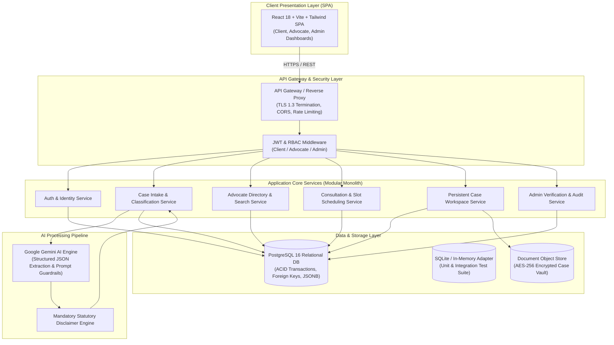
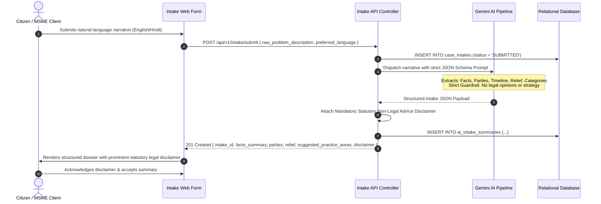
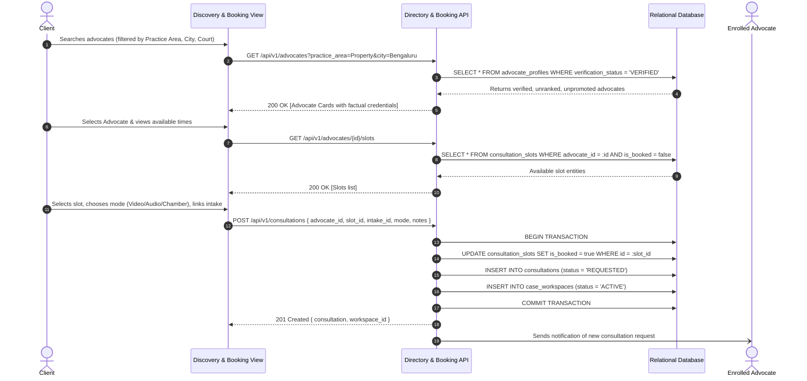
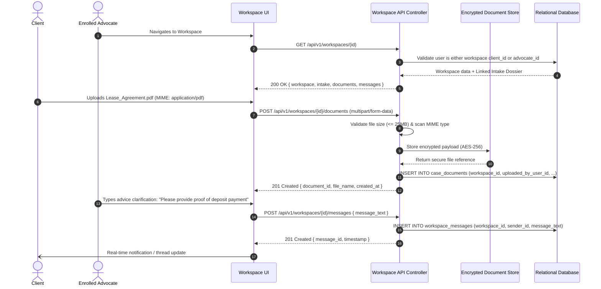

# System Architecture Specification
# LegalConnect by CalmStacks (MVP v1.0)

**Document Reference**: `docs/architecture/legalconnect-architecture.md`  
**Status**: APPROVED / ARCHITECTURE FROZEN  
**Author**: Lead System Architect (`skills/project-planning`)  
**Product Reference**: `docs/prd/legalconnect-mvp.prd.md`  
**Target Jurisdiction**: Republic of India (Advocates Act 1961, BCI Rules, DPDPA 2023)

---

## 1. Executive Summary & Architectural Mission

**LegalConnect** is a compliance-first digital legal gateway designed to connect Indian citizens and MSMEs with verified legal practitioners. The architecture bridges the severe communication gap between layperson dispute narratives and formal statutory advocacy while strictly adhering to statutory boundaries:

1. **Bar Council of India (BCI) Rule 36 Compliance**: The system operates exclusively as a non-promotional, unranked directory and secure collaboration utility. It strictly excludes sponsored listings, fee bidding, subjective reviews, star ratings, or client testimonials.
2. **AI Advice Segregation**: The AI Case Assistant is architecturally isolated to syntactic normalization, fact extraction, and procedural taxonomy classification. It is structurally prohibited from issuing legal opinions, litigation probabilities, or statutory strategy.
3. **Privilege & Confidentiality**: Case records, consultations, and document vaults enforce cryptographic isolation under the Digital Personal Data Protection Act, 2023 (DPDPA) and Section 126 of the Indian Evidence Act, 1872 / Section 132 of the Bharatiya Sakshya Adhiniyam, 2023.

---

## 2. System Topology



### 2.1 Topology Descriptions
- **Client Presentation Layer**: Single Page Application built on React, Vite, and Tailwind CSS. Provides unified role-aware interfaces for Citizens/MSMEs, Enrolled Advocates, and Platform Verification Officers.
- **Ingress & Security Layer**: Fastify/Express HTTP gateway handling TLS 1.3 termination, DPDPA consent metadata validation, rate limiting, and JWT token authentication.
- **Application Services**: A modular monolith architecture organized by distinct domain boundaries, facilitating strict internal cohesion and zero cyclic dependencies.
- **AI Processing Pipeline**: Decoupled asynchronous or synchronous ingestion pipeline invoking Google Gemini via strict JSON schema validation, augmented with automated statutory disclaimers.
- **Persistence Layer**: PostgreSQL 16 relational database with relational integrity, JSONB support for intake facts, and indexed multi-attribute search. A lightweight SQLite/in-memory abstraction allows headless test execution.
- **Encrypted Document Storage**: S3-compatible or file system storage backing the Case Document Vault with pre-signed access controls and AES-256 encryption at rest.

---

## 3. Component Boundaries & Micro-Modules

```
+----------------------------------------------------------------------------------------------------+
|                                    LEGALCONNECT DOMAIN MODULES                                     |
+--------------------------+-------------------------------------------------------------------------+
| Module                   | Responsibilities & Boundaries                                           |
+--------------------------+-------------------------------------------------------------------------+
| Auth & Identity          | User registration (Client, Advocate, Admin), password hashing (Argon2id|
|                          | or bcrypt), JWT token issuance/refresh, profile identity validation.    |
+--------------------------+-------------------------------------------------------------------------+
| Case Intake & AI         | Plain-language narrative ingestion, Gemini structured parsing (Facts,    |
| Structuring              | Parties, Timeline, Relief), statutory disclaimer injection, taxonomy    |
|                          | classification mapping.                                                 |
+--------------------------+-------------------------------------------------------------------------+
| Advocate Directory &     | BCI Rule 36 verified advocate registry, multi-faceted filtering         |
| Search                   | (practice area, court, city, language, fee), randomized fair ordering.  |
+--------------------------+-------------------------------------------------------------------------+
| Consultation &           | Advocate weekly slot publishing, booking conflict resolution, status    |
| Scheduling               | transitions (REQUESTED, CONFIRMED, RESCHEDULE_OFFERED, COMPLETED).      |
+--------------------------+-------------------------------------------------------------------------+
| Persistent Case          | Post-booking workspace lifecycle, bilateral message log, document vault  |
| Workspace                | with MIME validation, advocate private scratchpad notes.               |
+--------------------------+-------------------------------------------------------------------------+
| Admin & Moderation       | State Bar credential verification queue, audit logging, platform-wide   |
|                          | non-solicitation compliance metrics.                                    |
+--------------------------+-------------------------------------------------------------------------+
```

---

## 4. Data Flow Sequence Diagrams

### 4.1 Plain-Language Intake -> AI Structuring & Classification



### 4.2 Advocate Discovery -> Slot Selection -> Booking



### 4.3 Case Workspace Lifecycle -> Document Upload -> Messaging



---

## 5. Security, Authorization & Privacy Architecture

### 5.1 Role-Based Access Control (RBAC) Matrix

| Resource / Endpoint | Anonymous | Client | Advocate | Admin |
| :--- | :---: | :---: | :---: | :---: |
| `POST /api/v1/auth/register` | Allow | Deny | Deny | Deny |
| `POST /api/v1/auth/login` | Allow | Deny | Deny | Deny |
| `GET /api/v1/advocates` (Directory) | Allow | Allow | Allow | Allow |
| `POST /api/v1/intake/submit` | Deny | Allow | Deny | Deny |
| `GET /api/v1/intake/{id}/summary` | Deny | Owner Only | Assigned Advocate | Deny |
| `POST /api/v1/consultations` | Deny | Allow | Deny | Deny |
| `PATCH /api/v1/consultations/{id}/status` | Deny | Owner Only | Assigned Advocate | Admin |
| `GET /api/v1/workspaces/{id}/*` | Deny | Participant | Participant | Deny* |
| `GET /api/v1/admin/*` | Deny | Deny | Deny | Allow |

*\*Note: Platform Administrators are barred from inspecting confidential case communications and documents in order to preserve legal privilege, unless an explicit court order or statutory abuse investigation is triggered.*

### 5.2 Bar Council of India (BCI) Rule 36 Compliance Engine
1. **Zero Advertising Directives**:
   - Advocate listings are rendered in uniform layout and typography.
   - Algorithms do not implement weighted bids, promotional sponsorships, or "top-rated" flags.
   - Results are sorted deterministically by filter relevance and earliest open calendar slot, with tie-breaking randomized.
2. **Statutory Credentials Only**:
   - Profiles contain only: State Bar Council Enrollment Number, Year of Enrollment, Admitted Courts, Practice Categories, Spoken Languages, Office Location, and Consultation Fee.
   - Prohibited attributes: Client ratings, star reviews, case success statistics, or subjective marketing taglines.

### 5.3 Digital Personal Data Protection Act, 2023 (DPDPA) Compliance
1. **Purpose Limitation**:
   - Client legal problem narratives are collected exclusively to facilitate advocate matching and briefing.
   - AI processing is zero-retention for training: narratives are sent via enterprise API with zero data logging for model training.
2. **Advocate-Client Privilege Safeguards**:
   - Case documents and messages are siloed strictly by `workspace_id`.
   - Foreign key constraints ensure only the authenticated client and the assigned advocate can query workspace artifacts.
   - Encryption at rest (AES-256) and TLS 1.3 in transit.

---

## 6. Technology Stack Selections & Justifications

```
+----------------------------------------------------------------------------------------------------+
|                                    TECHNOLOGY STACK SELECTIONS                                     |
+-------------------+---------------------------+----------------------------------------------------+
| Layer             | Technology Selection      | Justification                                      |
+-------------------+---------------------------+----------------------------------------------------+
| Frontend SPA      | React 18 + Vite           | Ultra-fast HMR, lightweight component ecosystem,   |
|                   | Tailwind CSS              | accessible design system, zero client bundle bloat.|
+-------------------+---------------------------+----------------------------------------------------+
| Backend Service   | Node.js 20 LTS            | Async I/O efficiency, native JSON handling,        |
|                   | TypeScript 5.x            | end-to-end type safety shared via contracts/types.ts|
|                   | Fastify / Express         | High-throughput HTTP routing, OpenAPI integration.  |
+-------------------+---------------------------+----------------------------------------------------+
| Persistence Layer | PostgreSQL 16             | ACID transactional guarantees for booking slots,   |
|                   |                           | JSONB for structured intake facts, mature indexes. |
+-------------------+---------------------------+----------------------------------------------------+
| Test Portability  | SQLite / In-Memory        | Zero external dependency requirement for headless  |
|                   | Knex / Kysely Query Layer | CI/CD and developer local test suites.             |
+-------------------+---------------------------+----------------------------------------------------+
| AI Pipeline       | Google Gemini API         | Structured JSON output adherence, multilingual     |
|                   | (Gemini 1.5 Flash / Pro)  | comprehension (Hindi, English), low latency.       |
+-------------------+---------------------------+----------------------------------------------------+
| Document Vault    | S3 Compatible / Local FS  | Encrypted object storage with signed URL access    |
|                   | (AES-256)                 | control and strict file MIME validation.           |
+-------------------+---------------------------+----------------------------------------------------+
```

---

## 7. Architectural Risk Analysis & Mitigations

1. **AI Hallucination in Legal Intake**:
   - *Risk*: AI inventing legal claims, sections, or factual claims not present in client narrative.
   - *Mitigation*: The prompt enforces zero-shot extraction restricted to text-grounded facts. When key elements are missing, the AI flags them in a missing information block rather than speculating.
2. **Double-Booking Race Conditions**:
   - *Risk*: Two clients concurrently attempting to reserve the exact same advocate slot.
   - *Mitigation*: Database-level transactional locking (`SELECT FOR UPDATE` or `WHERE is_booked = false` atomic update) ensures atomic reservation.
3. **Privilege Leaks Across Workspaces**:
   - *Risk*: A client or advocate accessing case files belonging to another workspace.
   - *Mitigation*: Authorization middleware performs mandatory relational verification on every document/message query, validating that the requesting user's ID matches the workspace's `client_id` or `advocate_id`.
