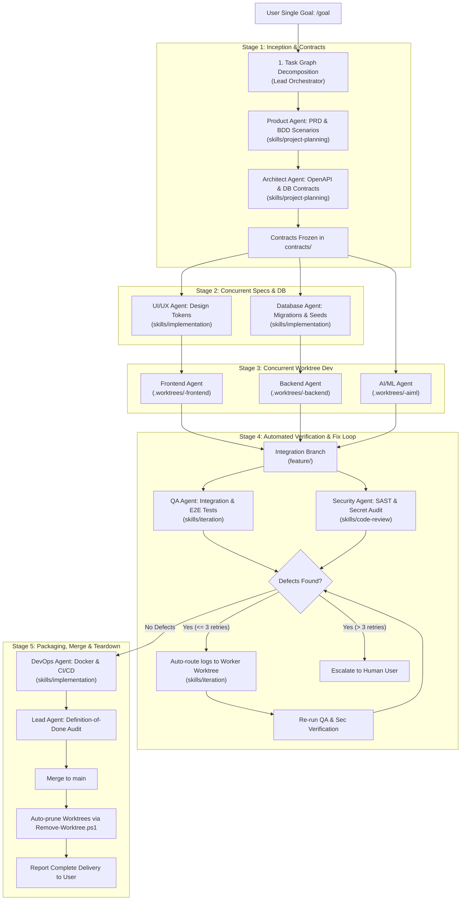

# CalmStacks Agent Factory: One-Prompt Autonomous Build Architecture

## Executive Policy
The CalmStacks Agent Factory operates under an **Autonomous One-Prompt Delivery Model**. 

When a user submits a high-level project goal (typically initiated with or without `/goal`), the **Lead Orchestrator** executes the entire engineering lifecycle end-to-end without pausing for intermediate conversational approvals during normal development.

Human intervention is strictly reserved for genuine blocking decisions (ambiguous product scope, secrets/credentials, destructive actions, legal/compliance, or exhausted retry limits). For ordinary engineering decisions, the Lead Orchestrator and specialist agents select the smallest reasonable, maintainable engineering decision and proceed autonomously.

---

## 1. The 20-Point Orchestrator Operating Policy

1. **Goal Intent**: Treat user requests beginning with `/goal` (or high-level feature requests) as autonomous delivery mandates.
2. **Zero Unnecessary Confirmation**: Never pause the pipeline to ask for intermediate confirmations during standard development phases.
3. **Deep Context Awareness**: Always consult `AGENTS.md`, `.agents/registry.json`, relevant `.agents/agents/*.md` definitions, and `.agents/skills/*/SKILL.md` runbooks.
4. **Dependency-Aware Task Graph**: Decompose every goal into an explicit Directed Acyclic Graph (DAG) with frozen contracts as synchronization barriers.
5. **Concurrent Subagent Dispatch**: Invoke independent specialist subagents concurrently using `invoke_subagent`.
6. **Isolated Git Worktrees**: Mandate isolated Git worktrees (`.worktrees/<feature>-<agent>/`) for all implementation agents (`frontend`, `backend`, `aiml`). Never modify `main` directly.
7. **No Context Switching**: Do not require the user to switch into worker subagent conversations.
8. **No Interactive Blocking**: Do not require the user to press Enter or approve non-destructive background commands for worker agents.
9. **Structured Handoffs**: Require all workers to return standardized machine-readable handoffs (`docs/handoffs/<feature>-<agent>.json`) with verifiable test logs.
10. **Asynchronous Monitoring**: Monitor worker progress reactively via Antigravity 2.0 wakeup events without wasteful polling loops.
11. **Automatic Dependency Unblocking**: Automatically trigger downstream tasks as soon as upstream prerequisites (e.g. contracts or schemas) are satisfied.
12. **Automated Defect Loop (Self-Healing)**: When QA or Security detects a defect:
    - Route the failure log and stack trace back to the offending worker's worktree.
    - Instruct the worker to fix the bug and re-run local tests.
    - Re-test against QA/Security gates.
    - Repeat up to 3 times before escalating.
13. **Automated Definition of Done**: Verify all 7 DoD requirements before approving integration.
14. **Protected Main**: `main` remains locked and stable until final release gates pass.
15. **Integration Branch Management**: Automatically prepare the integration branch (`feature/<feature-name>`) and merge only when all quality gates pass.
16. **Automatic Worktree Pruning**: Automatically clean up and prune worktrees via `Remove-Worktree.ps1` after successful integration.
17. **Zero Fabrication Protocol**: Never invent test results, external verification, user feedback, or completion states.
18. **Strict Escalation Gating**: Prompt the human user ONLY for genuine blocking decisions.
19. **Smallest Safe Engineering Decisions**: When minor ambiguities occur in implementation, pick the smallest safe, maintainable solution and continue.
20. **Action Over Narration**: Prefer autonomous execution and concrete artifact generation over conversational narration.

---

## 2. One-Prompt Autonomous Execution Flow

---

## 3. The 5 Human Intervention Gates

The Lead Orchestrator will **never** pause execution except when encountering one of the following blocking conditions:

| Gate | Category | Description | Orchestrator Action |
| :---: | :--- | :--- | :--- |
| **G-1** | **Product / Business Ambiguity** | Irreconcilable conflict in business requirements or mutually exclusive business models where engineering assumptions would compromise product strategy. | Formulates concise multi-choice clarification for user. |
| **G-2** | **Secrets & Production Credentials** | Third-party API keys (e.g. OpenAI, Stripe, AWS, SendGrid) or private database passwords required for live deployment that cannot be mocked. | Prompts user to securely inject credentials via environment variables. |
| **G-3** | **Irreversible / Destructive Operations** | Operations that risk data loss: dropping production database tables, destroying cloud infrastructure, or overwriting external remote Git repos. | Requests explicit confirmation detailing the exact scope of destruction. |
| **G-4** | **Legal & Regulatory Compliance** | Decisions regarding handling sensitive personal data (GDPR, HIPAA, PII storage) or incompatible open-source licenses (e.g. AGPL in proprietary software). | Escalates policy decision to human authority. |
| **G-5** | **Exhausted Automated Fix Loop** | A worker agent fails to resolve an automated test, contract mismatch, or security vulnerability after 3 consecutive automated repair attempts. | Surfaces the exact test failure logs and history of attempted fixes to the user. |

---

## 4. Definition-of-Done (DoD) Checklist

Before the Lead Orchestrator permits a merge into `main`, it autonomously verifies:
- [x] **Requirement Met**: All PRD user stories and BDD criteria satisfied.
- [x] **Contracts Respected**: API and schema implementations match `contracts/`.
- [x] **Tests Pass**: Unit, integration, and E2E browser tests pass 100% with real logs.
- [x] **Zero Secrets**: Secret scan confirms 0 API keys or credentials in commit history.
- [x] **Code Quality**: Zero type errors, clean linter run, no duplicated business logic.
- [x] **Worktree Clean**: No unstaged diffs or uncommitted files left in worker worktrees.
- [x] **No Fabricated Results**: All results verified through executable proof logs.
