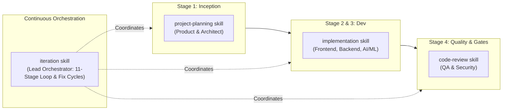

# CalmStacks Agent Factory: Skills Architecture & Workflow

## Overview
Workspace Skills in CalmStacks Agent Factory (`.agents/skills/<name>/SKILL.md`) provide reusable, specialized procedures, checklists, and runbooks that guide autonomous agents through distinct operational phases without cluttering global system prompts.

---

## 1. Skill Discovery Mechanism

Antigravity discovers workspace skills hierarchically:
1. **Directory Discovery**: On startup or workspace scan, Antigravity traverses `.agents/skills/` located at the repository root.
2. **Metadata Ingestion**: Antigravity extracts the YAML frontmatter (`name`, `description`) from each `SKILL.md`.
3. **Progressive Disclosure**:
   - Only the skill names and descriptions are initially registered into the agent's context.
   - The detailed body of a `SKILL.md` is loaded dynamically when activated via `view_file` or when invoked by a subagent.
   - This prevents context window saturation while making deep operational procedures available on demand.

---

## 2. Skill Selection & Invocation Models

### A. Autonomous Selection (Model Decision)
- When an agent is confronted with a specific problem domain (e.g. initial requirements scoping, implementation inside a worktree, PR code review), the agent inspects the available skill catalog in its prompt context.
- If a skill matches the current task, the agent autonomously reads `SKILL.md` to load the detailed procedure.

### B. Explicit Invocation (Orchestrator Mandate)
- The Lead Orchestrator can explicitly instruct worker subagents to follow a specific skill during dispatch:
  ```json
  {
    "TypeName": "backend",
    "Role": "Backend Agent",
    "Prompt": "Implement user auth endpoint following .agents/skills/implementation/SKILL.md..."
  }
  ```

---

## 3. How Skills Interact with Custom Subagents

While **Custom Subagents** (`.agents/agents/*.md`) define **who** is doing the work (roles, scopes, models, boundaries), **Skills** (`.agents/skills/*/SKILL.md`) define **how** the work is systematically executed.

| Custom Subagent | Primary Associated Skills | Role in Skill Execution |
| :--- | :--- | :--- |
| **Product Agent** | `project-planning` | Executes BDD breakdown, defines personas and scope boundaries. |
| **Architect Agent** | `project-planning`, `code-review` | Derives architecture tasks, reviews contract conformance. |
| **Frontend Agent** | `implementation`, `iteration` | Operates within worktree following smallest safe change rules. |
| **Backend Agent** | `implementation`, `iteration` | Operates within worktree following typing and error handling rules. |
| **QA Agent** | `iteration`, `code-review` | Enforces test matrix and browser verification cycles. |
| **Security Agent** | `code-review` | Performs SAST and secret scanning audits. |
| **Lead Orchestrator** | `iteration`, `code-review` | Enforces the 11-stage loop, resolves defect loops, signs off DoD. |

---

## 4. Pipeline Integration (Where Skills Fit)



- **Inception & Planning**: `project-planning` drives Stage 1.
- **Worker Execution**: `implementation` governs Stage 3 development inside Git worktrees.
- **Continuous Quality**: `code-review` enforces Stage 4 review verdicts before integration.
- **End-to-End Orchestration**: `iteration` provides the overarching 11-stage state machine that drives defect remediation loops until all DoD criteria are satisfied.
