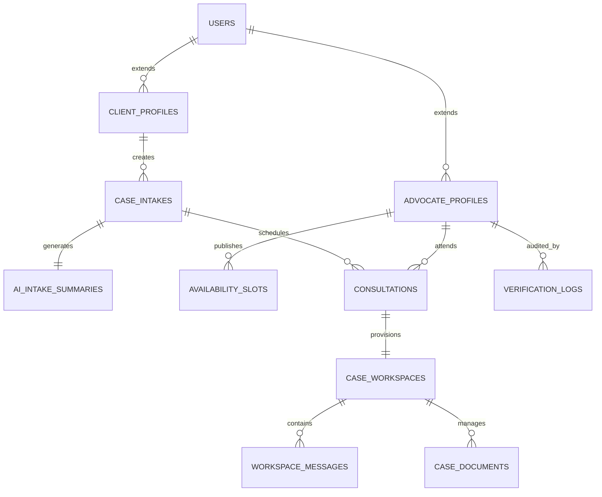
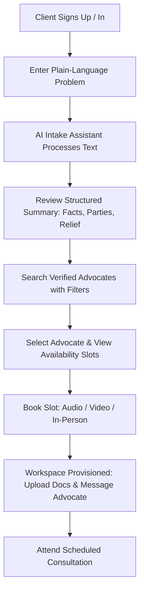
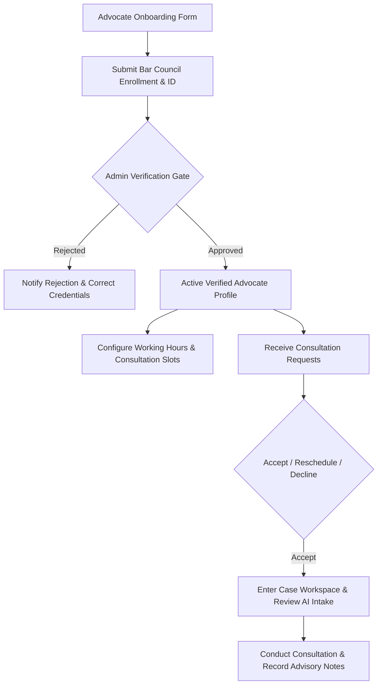
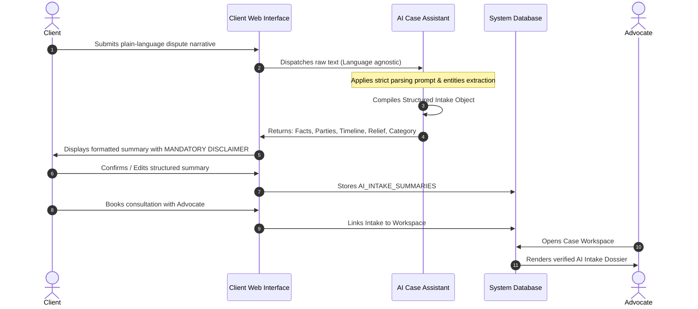

# Product Requirements Document (PRD)
# LegalConnect by CalmStacks (MVP)

**Document Reference**: `docs/prd/legalconnect-mvp.prd.md`  
**Status**: APPROVED / SPECIFICATION COMPLETE  
**Author**: Product Agent (`skills/project-planning`)  
**Target Release**: MVP v1.0  
**Target Jurisdiction**: Republic of India  

---

## 1. Executive Summary & Problem Definition

### 1.1 Executive Summary
**LegalConnect by CalmStacks** is an ethical, secure, and compliance-first digital legal gateway designed specifically for the Indian legal ecosystem. The platform empowers citizens and micro, small, and medium enterprises (MSMEs) to articulate legal predicaments in conversational plain language, extract structured case facts through a specialized AI Case Assistant, discover verified legal practitioners across specific jurisdictions and practice areas, schedule consultations (audio, video, or in-person), and collaborate continuously within an encrypted, persistent Case Workspace.

LegalConnect operates strictly as a **neutral technological facilitator and informational directory** in accordance with the Advocates Act, 1961 and the Bar Council of India (BCI) Rules.

### 1.2 Problem Definition
1. **Intimidating Vernacular & High Cognitive Load**: Laypersons facing legal disputes (e.g., landlord-tenant disputes, cheque bounce under Section 138 NI Act, matrimonial discord, consumer deficiency) struggle to comprehend legal jargon, identify proper statutory relief, or categorize their problems accurately.
2. **Opaque & Fragmented Advocate Discovery**: Finding qualified, verified advocates practicing in the requisite forum (e.g., District Court, High Court, NCLT, Consumer Commission) relies heavily on informal, non-standardized word-of-mouth networks. Clients lack transparent insight into practice focus, experience, forum appearances, and consultation fee structures.
3. **High Consultation Friction**: Scheduling initial legal advisory sessions involves cumbersome manual back-and-forth, unclear availability, and a lack of standardized briefing materials before the meeting begins.
4. **Scattered Post-Consultation Communication**: Post-consultation documents, notices, court orders, and follow-ups are typically dispersed across insecure channels (SMS, consumer chat apps, email threads), leading to lost evidentiary documents, compromised confidentiality, and missed limitation deadlines.

### 1.3 Indian Legal & Regulatory Context

```
+-----------------------------------------------------------------------------------+
|                           REGULATORY COMPLIANCE FRAMEWORK                         |
+-----------------------------------------------------------------------------------+
|  1. Advocates Act, 1961 & BCI Rules (Rule 36, Section IV):                        |
|     - Absolute prohibition against legal advertising, solicitation, or touting.   |
|     - Non-promotional, factual directory format only.                             |
|     - True, unembellished profile attributes: Enrollment No., Year, Courts, Fee.  |
|                                                                                   |
|  2. Legal Advice Separation:                                                      |
|     - AI Case Assistant strictly delivers procedural intake structuring.          |
|     - Explicit statutory disclaimer: AI DOES NOT PROVIDE LEGAL ADVICE.            |
|                                                                                   |
|  3. Digital Personal Data Protection Act, 2023 (DPDPA) & IT Act, 2000:           |
|     - Purpose-limited data processing and client consent for advocate sharing.    |
|     - End-to-end data encryption and privileged confidentiality safeguards.       |
+-----------------------------------------------------------------------------------+
```

1. **Bar Council of India Compliance (Rule 36)**:
   - Under Chapter II, Part VI, Rule 36 of the Bar Council of India Rules, advocates are strictly prohibited from advertising or soliciting work, directly or indirectly.
   - LegalConnect does **not** rank advocates via sponsored bids, paid promotions, subjective rating badges, or public star reviews.
   - The platform serves exclusively as an informational directory and workspace utility where advocate profiles display only factual, verifiable credentials (enrollment number, state bar council, years of standing, practice areas, admitted courts, languages spoken, and schedule fees).
2. **Multilingual & Plain-Language Intake**:
   - India's litigant base represents diverse linguistic backgrounds across Hindi, English, and regional dialects.
   - The platform enables intake submission in natural conversational text, which the AI transforms into standardized legal summaries (Facts, Parties, Timeline, Relief) for verified advocate review.
3. **Confidentiality & Privilege (Indian Evidence Act / Bharatiya Sakshya Adhiniyam, 2023)**:
   - Communication between advocate and client carries statutory privilege. LegalConnect ensures case records, client disclosures, and uploaded legal annexures are encrypted, siloed, and accessible only by authorized participants.

---

## 2. Target Personas

### 2.1 Persona 1: The Client (Citizen / MSME Owner)
- **Profile**: A citizen, tenant, employee, consumer, or small business entrepreneur based in India experiencing an emergent legal grievance.
- **Pain Points**:
  - Does not know which section or court applies to their situation.
  - Anxious about being overcharged or consulting an unverified practitioner.
  - Frustrated by disorganized document sharing and lack of clear next steps.
- **Goals**:
  - Describe the issue in simple, day-to-day language without legal jargon.
  - Obtain an organized summary of their dispute to share with an advocate.
  - Search and filter verified advocates by court, language, city, and verified fee.
  - Book an advisory slot and retain a single workspace for all case documents.

### 2.2 Persona 2: The Advocate (Verified Legal Practitioner)
- **Profile**: An advocate enrolled with a State Bar Council (e.g., Bar Council of Delhi, Bar Council of Maharashtra & Goa), actively appearing before District Courts, High Courts, or specialized Tribunals.
- **Pain Points**:
  - Spends substantial billable hours conducting preliminary intake and filtering unorganized client narratives.
  - Clients arrive at consultations missing foundational documents (contracts, receipts, notices).
  - Struggles with scheduling no-shows and fragmented messaging across private phone channels.
- **Goals**:
  - Establish a verified, BCI-compliant professional profile detailing admitted courts and practice focus.
  - Receive structured preliminary intake summaries (Facts, Parties, Timeline, Requested Relief) before consultations.
  - Manage available advisory consultation slots with automated scheduling.
  - Maintain an organized, professional digital case file with uploaded client annexures.

### 2.3 Persona 3: Platform Administrator & Verification Officer
- **Profile**: CalmStacks platform compliance and operations officer.
- **Pain Points**:
  - Risk of unverified actors or suspended practitioners attempting to join the platform.
  - Risk of non-compliant marketing language or spam inquiries entering the ecosystem.
- **Goals**:
  - Audit and authenticate advocate State Bar enrollment certificates and identity records against Bar registries before granting live listing.
  - Monitor platform health, dispute escalations, abuse reports, and booking completion rates.
  - Enforce regulatory standards and platform safety policies.

---

## 3. Core System Architecture & Entity Relationships



---

## 4. User Workflows & Functional Requirements

### 4.1 Client Workflows



#### 4.1.1 Authentication & Profile Setup
- **Req-CL-101**: Secure registration and login via mobile phone number (OTP-based) or Email + Password, with standard password complexity enforcement.
- **Req-CL-102**: Basic profile setup: Full legal name, contact phone number, state/city, and preferred language for communication.

#### 4.1.2 Plain-Language Intake Form
- **Req-CL-201**: Guided intake portal allowing the client to describe their legal situation in narrative format without mandatory legal citations.
- **Req-CL-202**: Key intake prompts:
  - *What happened?* (Narrative description of the incident/dispute).
  - *Who is involved?* (Opposing individual, company, landlord, government agency).
  - *When did it happen?* (Dates or approximate chronological timeframe).
  - *What outcome or resolution do you seek?* (Financial recovery, defense against eviction, contract termination, mutual separation, injunction).
  - *Do you have existing legal documents or notices?* (Checkbox with file pre-upload option).
- **Req-CL-203**: Multi-language input support (Romanized Hindi, standard Hindi, English).

#### 4.1.3 Advocate Discovery & Filtering
- **Req-CL-301**: Neutral, unranked search and directory filter interface. Default sorting is randomized or by calendar slot availability; no advocate may purchase top ranking.
- **Req-CL-302**: Multi-faceted filtering capabilities:
  - **Practice Area**: Civil Litigation, Criminal Defense, Family/Matrimonial, Property & Real Estate, Corporate/Commercial, Consumer Disputes, Labour & Employment, Intellectual Property, Tax.
  - **Jurisdiction & Court Admitted**: Supreme Court of India, State High Courts, District & Sessions Courts, Debt Recovery Tribunals (DRT), National Company Law Tribunal (NCLT), Consumer Disputes Redressal Commissions.
  - **Geographic Location**: State and City/District.
  - **Languages Spoken**: English, Hindi, Bengali, Tamil, Telugu, Marathi, Kannada, Gujarati, Malayalam, Punjabi, etc.
  - **Consultation Mode**: Audio Call, Video Call, In-Person Chamber Visit.
  - **Consultation Fee Range**: Stated transparently per 30-minute or 45-minute introductory consultation session.
  - **Earliest Available Slot**: Today, Tomorrow, This Week.
- **Req-CL-303**: Profile view displays Bar Enrollment Number, State Bar Council, years of standing, admitted forums, office address (for chamber meetings), educational background, and consultation rates.

#### 4.1.4 Consultation Booking
- **Req-CL-401**: Slot selector displaying real-time available advocate calendar windows.
- **Req-CL-402**: Mode selection: Audio, Encrypted Video, or In-Person Chamber Consultation.
- **Req-CL-403**: Consultation briefing: The client can attach the AI-generated intake summary and relevant pre-uploaded documents to the booking request.
- **Req-CL-404**: Booking confirmation receipt with calendar invite (.ics file) generation, appointment reminders via SMS/Email, and link to the designated Case Workspace.

#### 4.1.5 Persistent Case Workspace
- **Req-CL-501**: Dedicated, persistent workspace provisioned upon consultation booking.
- **Req-CL-502**: Secure chronological messaging thread between the client and the booked advocate.
- **Req-CL-503**: Document Vault:
  - Drag-and-drop file upload supporting PDF, PNG, JPG, and DOCX formats (max 25MB per file).
  - Categorization tags: *Agreement/Contract*, *Legal Notice*, *Police Complaint/FIR*, *Court Order/Pleadings*, *Identity Proof*, *Financial Statement*.
- **Req-CL-504**: Case Status Lifecycle Tracker:
  - `INTAKE_DRAFTED` -> `CONSULTATION_REQUESTED` -> `CONSULTATION_CONFIRMED` -> `CONSULTATION_COMPLETED` -> `ADVISORY_ISSUED` -> `CLOSED`.
- **Req-CL-505**: In-app notifications for appointment confirmations, advocate responses, reschedule alerts, and file uploads.

---

### 4.2 Advocate Workflows



#### 4.2.1 Onboarding & Profile Setup
- **Req-AD-101**: Dedicated advocate registration capturing:
  - Full Name as listed in State Bar rolls.
  - State Bar Council Enrollment Number (e.g., `D/1234/2015`).
  - Year of Enrollment & total years of active practice.
  - Upload of Bar Council Identity Card / Enrolment Certificate.
  - Primary Chamber / Office Address and Pin Code.
  - Admitted Courts / Tribunals of regular appearance.
  - Practice Area categorizations (maximum 5 for MVP to prevent generalized spamming).
  - Languages of consultation.
  - Fixed Consultation Fee for standardized 30-minute / 45-minute introductory sessions.
- **Req-AD-102**: Profile remains in `PENDING_VERIFICATION` status; advocate does not appear in client search results until verified by a Platform Admin.

#### 4.2.2 Availability & Slot Management
- **Req-AD-201**: Interactive weekly schedule manager allowing advocates to designate consultation blocks:
  - Day-of-week recurrence (e.g., Mon-Fri 16:00 - 19:00, Sat 10:00 - 14:00).
  - Session duration definition (default 30 mins, buffer time 10 mins).
  - Blackout dates and holiday overrides.
  - Permitted modes per slot (e.g., morning for Video/Audio, evening for In-Person chamber visits).

#### 4.2.3 Appointment Management
- **Req-AD-301**: Incoming consultation request dashboard displaying client name, scheduled time, consultation mode, and the structured AI intake summary.
- **Req-AD-302**: One-click actions:
  - **Accept**: Confirms appointment and notifies client.
  - **Reschedule**: Proposes 2 alternative available slots with optional reason.
  - **Decline**: Declines appointment with standard professional reason code (Conflict of interest, Forum mismatch, Unavailability).

#### 4.2.4 Case Workspace & Client Collaboration
- **Req-AD-401**: Access to client-uploaded documents with previewer and download capability.
- **Req-AD-402**: Workspace messaging for pre-consultation clarifications and post-consultation advisory follow-ups.
- **Req-AD-403**: Advocate Private Notes section: A secure, private scratchpad visible exclusively to the advocate for case law citations, strategy considerations, and internal research.
- **Req-AD-404**: Mark consultation complete and issue standardized post-consultation summary or checklist of next legal steps.

---

### 4.3 AI Case Assistant Workflows



#### 4.3.1 Plain-Language Intake Structuring
- **Req-AI-101**: Upon client submission, the AI Assistant analyzes narrative input and generates a deterministic structured JSON payload comprising:
  1. **Statement of Core Facts**: Bulleted, neutral sequence of what transpired.
  2. **Parties Involved**: Identified complainant/client, counterparty (individual, employer, vendor, landlord, public authority), and relationship.
  3. **Chronological Timeline**: Extracted dates, milestones, notices, transactions, or approximate temporal sequence.
  4. **Key Relief / Outcome Sought**: Specific remedy articulated by client (e.g., recovery of unpaid dues, recovery of security deposit, defense against suit, divorce petition guidance).
  5. **Suggested Practice Categories & Forums**: Tagged legal domains (e.g., `Consumer Protection`, `Negotiable Instruments Act`, `RERA/Real Estate`, `Family Law`).
- **Req-AI-102**: Non-hallucinatory parsing: When dates or details are ambiguous, the AI flags missing critical information (e.g., "Date of notice delivery not specified") rather than inferring facts.

#### 4.3.2 Practice Area & Forum Recommendation
- **Req-AI-201**: Maps extracted categories to standardized directory taxonomy, automatically pre-filtering advocate discovery options for the client.

#### 4.3.3 CRITICAL COMPLIANCE DIRECTIVE: Strict Legal Advice Disclaimer
- **Req-AI-301**: The AI Case Assistant is **strictly prohibited from rendering legal opinions, calculating legal prospects, suggesting win/loss probabilities, or advising on litigation strategy**.
- **Req-AI-302**: Mandatory statutory banner displayed prominently on every AI output screen:
  > **LEGAL NOTICE & STATUTORY DISCLAIMER**: This summary is automatically synthesized by an automated artificial intelligence system solely to assist you in organizing your factual statements for a legal practitioner. **The AI Case Assistant does NOT provide legal advice, legal counsel, or legal representation.** No advocate-client relationship is created by using this feature. Only a verified, enrolled advocate licensed by a State Bar Council can provide formal legal advice upon consultation.
- **Req-AI-303**: Complete visual and linguistic segregation: AI-generated summaries are styled with distinct cognitive framing (e.g., "Automated Factual Intake Summary - For Advocate Review") completely decoupled from the Advocate's consultation notes and professional communications.

---

### 4.4 Admin Workflows

#### 4.4.1 Advocate Verification Queue
- **Req-ADM-101**: Operational back-office dashboard listing pending advocate applications.
- **Req-ADM-102**: Verification tools:
  - Display applicant's submitted State Bar Council Enrollment Number, state bar roll, photo ID, and date of enrollment.
  - Link to verify credentials against state bar directories (e.g., Bar Council of Delhi, Bar Council of Tamil Nadu & Puducherry).
  - Action buttons: `Approve Advocate`, `Reject Application` (with reason feedback to advocate), or `Request Additional Documentation`.
- **Req-ADM-103**: Audit logging: Every verification action records Admin ID, timestamp, and verification rationale.

#### 4.4.2 User Moderation & Platform Safety
- **Req-ADM-201**: Review reported messages, inappropriate profile listings, or offensive content flagged by users.
- **Req-ADM-202**: Suspension and revocation: Immediate deactivation of non-compliant advocates or abusive clients.

#### 4.4.3 Platform Analytics
- **Req-ADM-301**: Real-time aggregated metrics: Total verified advocates, onboarding pipeline, active client intakes, consultations booked, consultation completion rate, and practice area distribution.
- **Req-ADM-302**: Explicit omission of ranking or competitive leaderboard analytics, preserving strict compliance with non-solicitation rules.

---

## 5. Detailed Behavior-Driven Development (BDD) Acceptance Criteria

### Feature 1: Plain-Language Intake & AI Structured Summary

```gherkin
Feature: Plain-Language Problem Intake and AI Structuring
  As a citizen facing a legal dispute
  I want to describe my predicament in everyday language
  So that my narrative is organized into a structured factual summary without legal jargon

  Scenario: Client successfully submits narrative and receives structured breakdown
    Given the client is logged into LegalConnect
    And the client navigates to the "Describe Your Legal Problem" intake page
    When the client enters "My landlord in Indiranagar Bengaluru is refusing to return my security deposit of 80,000 INR even though I vacated on 31st August 2026. He is not answering my calls since 15 days."
    And the client submits the intake form
    Then the AI Case Assistant should process the narrative within 5 seconds
    And the system should render a structured summary displaying:
      | Section       | Content                                                              |
      | Core Facts    | Landlord withholding INR 80,000 security deposit post vacating       |
      | Parties       | Client (Tenant) vs Landlord (Indiranagar, Bengaluru)                 |
      | Timeline      | Vacated premises on 31 August 2026; uncontactable for 15 days        |
      | Relief Sought | Return and refund of INR 80,000 security deposit                     |
      | Category      | Property & Real Estate / Tenancy Dispute                             |
    And a prominent non-legal advice statutory disclaimer must be displayed immediately above and below the summary
    And the client must be prompted to review, edit, or confirm the extracted details

  Scenario: Client narrative contains ambiguous or missing essential details
    Given the client is on the intake form
    When the client enters "My boss fired me without reason."
    And the client submits the intake form
    Then the AI summary should list the core fact and identify:
      | Missing Detail  | Description                                                 |
      | Timeline        | Date of employment termination not provided                |
      | Contract Status | Presence of appointment letter or severance terms unknown   |
    And the system should allow the client to augment the facts before proceeding to advocate discovery
```

### Feature 2: Bar Council Compliant Advocate Discovery & Filtering

```gherkin
Feature: BCI-Compliant Advocate Discovery
  As a client with a structured intake summary
  I want to search and filter verified advocates by practice area, court, and city
  So that I find a qualified legal practitioner without deceptive advertising or paid promotions

  Scenario: Filtering verified advocates by Practice Area and City
    Given 5 advocates are registered in Bengaluru for "Property & Real Estate"
    And 3 advocates are verified with State Bar Council credentials
    And 2 advocates are in "PENDING_VERIFICATION" status
    When the client searches for "Property & Real Estate" advocates in "Bengaluru"
    Then the search results must display exactly the 3 verified advocates
    And the 2 unverified advocates must not be visible
    And the search results must not contain "Featured", "Promoted", or "Sponsored" labels
    And each profile card must clearly show:
      | Field                 | Value                               |
      | State Bar Enrolment   | Masked/Verified State Bar Number    |
      | Experience            | Total years of standing             |
      | Admitted Courts       | List of courts regularly attended   |
      | Consultation Fee      | Transparent fee per fixed slot      |
      | Languages             | Languages spoken                    |

  Scenario: Viewing an advocate profile enforces statutory directory presentation
    Given an advocate profile for Adv. Rajesh Kumar enrolled with Bar Council of Delhi
    When any client or visitor navigates to the profile page
    Then the page title and metadata must display factual professional credentials only
    And there must be no subjective client ratings, star reviews, or promotional testimonials
    And an explicit button "Book Consultation" must be present with real-time slot availability
```

### Feature 3: Consultation Slot Booking & Case Workspace Provisioning

```gherkin
Feature: Consultation Booking and Workspace Provisioning
  As a client seeking legal counsel
  I want to book a specific date, time, and consultation mode with a verified advocate
  So that we can have a structured session and collaborate in a private workspace

  Scenario: Successfully booking a video consultation slot
    Given Adv. Meera Sharma has published availability for "Tomorrow at 16:00 IST" (Video mode)
    And the client has a confirmed intake summary for a "Consumer Dispute"
    When the client selects the 16:00 slot and chooses "Video Consultation"
    And the client confirms the appointment request with attached intake notes
    Then the slot should be marked as "BOOKED" in the advocate's calendar
    And a unique Case Workspace should be instantly provisioned with status "CONSULTATION_REQUESTED"
    And both the client and advocate should receive an instant email and in-app notification with calendar (.ics) details
    And the Case Workspace should be accessible from both the client's and advocate's dashboards

  Scenario: Advocate reschedules an incoming consultation request
    Given a consultation request is pending for "Thursday at 11:00 IST"
    When the advocate reviews the request and clicks "Reschedule"
    And the advocate provides two alternate slots: "Friday at 11:00 IST" and "Friday at 15:00 IST"
    Then the appointment status updates to "RESCHEDULE_PROPOSED"
    And the client receives an immediate alert prompting them to select one of the alternate slots or cancel
```

### Feature 4: Advocate Onboarding & Bar Council Credential Verification

```gherkin
Feature: Advocate Onboarding and Admin Verification
  As a practicing advocate in India
  I want to submit my Bar Council credentials for platform verification
  So that I can offer legitimate consultation services in compliance with legal standards

  Scenario: Advocate submits complete verification credentials
    Given a newly registered advocate navigates to "Profile Verification"
    When the advocate enters their Bar Enrollment Number "MAH/4521/2012"
    And selects State Bar Council "Bar Council of Maharashtra & Goa"
    And uploads a scan of their official Bar Council Certificate of Enrolment
    And submits the form
    Then the advocate profile status becomes "PENDING_VERIFICATION"
    And an entry is added to the Admin Verification Queue
    And the advocate is notified that verification takes 24-48 hours

  Scenario: Admin verifies advocate enrollment and activates profile
    Given an advocate application with Enrollment Number "MAH/4521/2012" is in the verification queue
    When a Platform Admin checks the credential against the Bar Council registry
    And the Admin marks the credential as "VERIFIED"
    Then the advocate status updates to "ACTIVE_VERIFIED"
    And the advocate's profile becomes discoverable in public search results
    And an automated welcome confirmation is sent to the advocate
```

### Feature 5: Secure Workspace Collaboration & Document Management

```gherkin
Feature: Case Workspace Document Management and Confidential Messaging
  As a client and advocate in an active case consultation
  I want to upload case documents and exchange encrypted messages
  So that all case artifacts are organized, privileged, and accessible in one place

  Scenario: Client uploads an agreement document to the workspace
    Given the client is inside the Case Workspace for Case #LC-8921
    When the client uploads "lease_agreement_2025.pdf" (Size: 4.2 MB)
    And tags the document category as "Agreement/Contract"
    Then the document should be scanned for safety, encrypted, and saved to the Case Vault
    And a system event log should record: "Client uploaded lease_agreement_2025.pdf"
    And the advocate should see the document available for secure in-browser viewing
    And the file must not be accessible to any user outside this specific case workspace
```

---

## 6. Scope Boundaries & Partitioning

```
+------------------------------------------------------------------------------------------------+
|                                    SCOPE PARTITIONING TABLE                                    |
+------------------------------------+-----------------------------------------------------------+
| IN-SCOPE (MVP v1.0)                | EXPLICITLY OUT-OF-SCOPE (Deferred to Post-MVP)            |
+------------------------------------+-----------------------------------------------------------+
| 1. User Auth & Role Segmentation   | 1. Escrow Payments / Financial Trust Accounts             |
|    (Client, Advocate, Admin)       |    (Consultation fees arranged/settled via standard       |
|                                    |    direct payment or off-platform voucher in MVP).        |
| 2. Plain-Language Legal Intake     | 2. Court e-Filing API Integrations                        |
|    & Multilingual input support    |    (No direct filing to e-Courts CIS or Supreme Court).  |
| 3. AI Intake Structuring Engine    | 3. Automated Legal Contract / Pleading Generation         |
|    (Facts, Parties, Timeline,      |    (AI does not draft legal notices, plaints, or writs).  |
|    Relief, Category)               | 4. In-App Video Call Infrastructure (WebRTC / Twilio)     |
| 4. BCI-Compliant Directory Search  |    (MVP uses automated secure third-party meeting links   |
|    & Multi-faceted filtering       |    e.g., Google Meet / Zoom integrated via URL).          |
| 5. Consultation Slot Scheduling    | 5. Multi-Advocate Law Firm Enterprise Management          |
|    (Audio, Video, In-Person)       | 6. Public Client Reviews, Ratings, or Star Badges         |
| 6. Case Workspace with Secure      |    (Strictly prohibited to ensure Bar Council compliance).|
|    Messaging & Document Vault      | 7. Direct Litigant Representation Booking                 |
| 7. Admin Verification Queue        |    (Platform facilitates advisory consultation only; court|
| 8. Full Statutory BCI Disclaimers  |    vakalatnama/appearance is negotiated independently).   |
+------------------------------------+-----------------------------------------------------------+
```

---

## 7. Data Models & Interface Contracts

### 7.1 Key Database Entities

#### `users`
- `id`: UUID (Primary Key)
- `email`: VARCHAR(255) UNIQUE NOT NULL
- `phone_number`: VARCHAR(15) UNIQUE NOT NULL
- `role`: ENUM (`CLIENT`, `ADVOCATE`, `ADMIN`) NOT NULL
- `full_name`: VARCHAR(255) NOT NULL
- `created_at`: TIMESTAMP WITH TIME ZONE DEFAULT NOW()
- `updated_at`: TIMESTAMP WITH TIME ZONE DEFAULT NOW()

#### `advocate_profiles`
- `id`: UUID (Primary Key, Foreign Key -> `users.id`)
- `bar_enrollment_number`: VARCHAR(100) UNIQUE NOT NULL
- `state_bar_council`: VARCHAR(150) NOT NULL
- `enrollment_year`: INT NOT NULL
- `experience_years`: INT NOT NULL
- `verification_status`: ENUM (`PENDING`, `VERIFIED`, `REJECTED`, `SUSPENDED`) DEFAULT `PENDING`
- `id_document_url`: VARCHAR(1024) NOT NULL
- `office_address`: TEXT NOT NULL
- `city`: VARCHAR(100) NOT NULL
- `state`: VARCHAR(100) NOT NULL
- `pincode`: VARCHAR(10) NOT NULL
- `admitted_courts`: JSONB (Array of court strings)
- `practice_areas`: JSONB (Array of practice strings, max 5)
- `languages`: JSONB (Array of language strings)
- `consultation_fee_inr`: NUMERIC(10, 2) NOT NULL
- `bio`: TEXT

#### `case_intakes`
- `id`: UUID (Primary Key)
- `client_id`: UUID (Foreign Key -> `users.id`)
- `raw_narrative`: TEXT NOT NULL
- `input_language`: VARCHAR(20) DEFAULT 'en'
- `status`: ENUM (`DRAFT`, `SUBMITTED`, `LINKED_TO_CASE`) DEFAULT `DRAFT`
- `created_at`: TIMESTAMP WITH TIME ZONE DEFAULT NOW()

#### `ai_intake_summaries`
- `id`: UUID (Primary Key)
- `intake_id`: UUID (Foreign Key -> `case_intakes.id`) UNIQUE
- `facts`: JSONB (Array of factual string statements)
- `parties`: JSONB (`{"client_role": "...", "counterparty_name": "...", "counterparty_type": "..."}`)
- `timeline`: JSONB (Array of `{"date_or_period": "...", "event": "..."}`)
- `relief_sought`: TEXT NOT NULL
- `extracted_categories`: JSONB (Array of category strings)
- `confidence_score`: NUMERIC(3, 2)
- `disclaimer_acknowledged`: BOOLEAN DEFAULT FALSE
- `created_at`: TIMESTAMP WITH TIME ZONE DEFAULT NOW()

#### `consultations`
- `id`: UUID (Primary Key)
- `client_id`: UUID (Foreign Key -> `users.id`)
- `advocate_id`: UUID (Foreign Key -> `advocate_profiles.id`)
- `intake_id`: UUID (Foreign Key -> `case_intakes.id`)
- `slot_start_time`: TIMESTAMP WITH TIME ZONE NOT NULL
- `slot_end_time`: TIMESTAMP WITH TIME ZONE NOT NULL
- `mode`: ENUM (`AUDIO`, `VIDEO`, `IN_PERSON`) NOT NULL
- `meeting_link_or_address`: TEXT
- `status`: ENUM (`REQUESTED`, `CONFIRMED`, `RESCHEDULE_OFFERED`, `DECLINED`, `COMPLETED`, `CANCELLED`) DEFAULT `REQUESTED`
- `fee_amount_inr`: NUMERIC(10, 2) NOT NULL
- `created_at`: TIMESTAMP WITH TIME ZONE DEFAULT NOW()

#### `case_workspaces`
- `id`: UUID (Primary Key)
- `consultation_id`: UUID (Foreign Key -> `consultations.id`) UNIQUE
- `client_id`: UUID (Foreign Key -> `users.id`)
- `advocate_id`: UUID (Foreign Key -> `advocate_profiles.id`)
- `status`: ENUM (`ACTIVE`, `ADVISORY_ISSUED`, `CLOSED`) DEFAULT `ACTIVE`
- `advocate_private_notes`: TEXT
- `created_at`: TIMESTAMP WITH TIME ZONE DEFAULT NOW()

#### `workspace_messages`
- `id`: UUID (Primary Key)
- `workspace_id`: UUID (Foreign Key -> `case_workspaces.id`)
- `sender_id`: UUID (Foreign Key -> `users.id`)
- `content`: TEXT NOT NULL
- `created_at`: TIMESTAMP WITH TIME ZONE DEFAULT NOW()

#### `case_documents`
- `id`: UUID (Primary Key)
- `workspace_id`: UUID (Foreign Key -> `case_workspaces.id`)
- `uploaded_by`: UUID (Foreign Key -> `users.id`)
- `file_name`: VARCHAR(255) NOT NULL
- `file_url`: VARCHAR(1024) NOT NULL
- `file_size_bytes`: BIGINT NOT NULL
- `mime_type`: VARCHAR(100) NOT NULL
- `document_category`: ENUM (`AGREEMENT`, `LEGAL_NOTICE`, `POLICE_COMPLAINT`, `COURT_RECORD`, `ID_PROOF`, `FINANCIAL_STATEMENT`, `OTHER`) NOT NULL
- `created_at`: TIMESTAMP WITH TIME ZONE DEFAULT NOW()

---

### 7.2 Core API Endpoints

| Method | Endpoint | Description | Auth Required |
| :--- | :--- | :--- | :---: |
| `POST` | `/api/v1/auth/register` | Register new user (Client or Advocate) | No |
| `POST` | `/api/v1/auth/login` | Authenticate and obtain JWT token | No |
| `POST` | `/api/v1/intake/process` | Submit raw narrative; triggers AI structured extraction | Client |
| `GET` | `/api/v1/intake/{id}/summary` | Retrieve structured AI intake summary with disclaimers | Client, Advocate |
| `GET` | `/api/v1/advocates` | Search and filter verified advocates (Directory listing) | Any |
| `GET` | `/api/v1/advocates/{id}` | Retrieve factual advocate profile details | Any |
| `POST` | `/api/v1/advocate/profile` | Submit advocate profile and Bar verification details | Advocate |
| `GET` | `/api/v1/advocate/{id}/slots` | Retrieve available consultation slots for advocate | Any |
| `POST` | `/api/v1/consultations/book` | Book a consultation slot and create workspace | Client |
| `PATCH` | `/api/v1/consultations/{id}/action` | Accept, Reschedule, or Decline appointment | Advocate, Client |
| `GET` | `/api/v1/workspaces/{id}` | Get workspace details, documents, and messages | Client, Advocate |
| `POST` | `/api/v1/workspaces/{id}/messages`| Send chronological message in workspace | Client, Advocate |
| `POST` | `/api/v1/workspaces/{id}/documents`| Upload document to workspace document vault | Client, Advocate |
| `GET` | `/api/v1/admin/verification-queue`| List pending advocate verification requests | Admin |
| `PATCH` | `/api/v1/admin/verify-advocate/{id}`| Approve or Reject advocate credentials | Admin |
| `GET` | `/api/v1/admin/analytics/overview` | Platform health and active case counts | Admin |

---

## 8. Risk Assessment, Regulatory Hazards & Mitigations

| Risk / Regulatory Hazard | Severity | Impact | Mitigation Strategy |
| :--- | :---: | :---: | :--- |
| **Bar Council Advertising Violation (Rule 36)** | High | Platform legal injunction or advocate disciplinary action | Enforce strict directory model: NO sponsored advocate placements, NO rating stars, NO client testimonials. Profile layouts are uniform and strictly limited to factual bar records. |
| **Unlawful Practice of Law by AI Engine** | Critical | Violation of Advocates Act, 1961 (exclusive right to practice) | AI engine is programmatically constrained to factual intake decomposition and categorization. Prominent non-legal advice banners appear on every screen. AI never provides case merits or legal strategy. |
| **Unauthorized Practitioner Listing** | High | Fraudulent advisory and compromised client rights | Mandatory Admin verification gate. Advocates remain unlisted and unable to take bookings until State Bar enrollment card/certificate is audited against bar records. |
| **Data Breach / Privileged Disclosure** | High | Violation of DPDPA 2023 and advocate-client privilege | Encrypted workspace document storage (AES-256 at rest, TLS 1.3 in transit). Strict role-based isolation ensuring files are only accessible to the assigned advocate and client. |
| **Booking No-Shows / Unresponsive Advocates** | Medium | Client dissatisfaction and dropped consultations | Automated reminders via SMS/Email 24h and 1h prior to session; auto-rescheduling protocol and platform inactivity audits for advocates. |

---

## 9. Implementation Task Breakdown (Factory Agent Assignments)

### 9.1 Architecture Agent (`architect`)
- [ ] Author System Architecture Specification: `docs/architecture/legalconnect-architecture.md`
- [ ] Create formal OpenAPI 3.1 specification: `contracts/legalconnect-api.yaml`
- [ ] Define Architectural Decision Record (ADR): ADR-0005: BCI Rule 36 Compliance Directory Model & AI Advice Segregation
- [ ] Freeze JSON Schema validation models for AI Intake objects

### 9.2 Database Agent (`database`)
- [ ] Author PostgreSQL DDL migrations: `migrations/001_init_legalconnect.sql`
- [ ] Configure row-level security (RLS) policies for Case Workspaces and Case Documents
- [ ] Author deterministic seed fixtures: verified advocate directory, practice taxonomy, sample intake cases

### 9.3 AI/ML Agent (`aiml`)
- [ ] Construct zero-shot intake extraction prompt with strict JSON schema validation
- [ ] Build classification pipeline for Indian legal categories (Consumer, NI Act, Real Estate, Family, Criminal)
- [ ] Implement hallucination guardrails and automated compliance disclaimer injection
- [ ] Build automated unit test suite for multi-lingual intake parsing evaluation

### 9.4 Backend Agent (`backend`)
- [ ] Implement Auth module with JWT and role guards (`CLIENT`, `ADVOCATE`, `ADMIN`)
- [ ] Implement Intake API & AI integration handler
- [ ] Implement BCI-compliant Directory Search with multi-factor filters (practice area, court, language, fee)
- [ ] Implement Consultation Scheduling and Calendar Slot engine
- [ ] Implement Persistent Case Workspace API (chronological messages & document vault)
- [ ] Implement Admin Verification Queue endpoints

### 9.5 UI/UX & Frontend Agents (`uiux`, `frontend`)
- [ ] Define Indian legal ecosystem design tokens (accessible typography, high contrast, clean institutional layout)
- [ ] Build Plain-Language Intake Form with live parsing preview and prominent compliance disclaimer banners
- [ ] Build Advocate Directory Catalog with zero-bias filtering interface
- [ ] Build Consultation Slot Booking & Confirmation flow
- [ ] Build Persistent Case Workspace UI (Messaging view, Document upload/preview pane, Timeline widget)
- [ ] Build Advocate Availability Schedule Manager & Appointment acceptance modal
- [ ] Build Admin Verification Queue interface

### 9.6 QA & Security Agents (`qa`, `security`)
- [ ] Author E2E Playwright test suite for full Client Intake -> Discovery -> Booking -> Workspace journey
- [ ] Execute Bar Council Rule 36 compliance review (verify absence of ratings, rankings, and sponsored badges)
- [ ] Perform SAST security audit and RBAC access control penetration tests on document vault
- [ ] Verify DPDPA compliance: purpose limitation, consent notice, and access log retention

---

## 10. Document Approvals & Sign-off

- **Product Management**: CalmStacks Agent Factory Product Agent (`skills/project-planning`) - **APPROVED**
- **Lead Orchestrator**: Verified against Factory Multi-Agent Delivery Lifecycle - **READY FOR ARCHITECTURE DECOMPOSITION**
